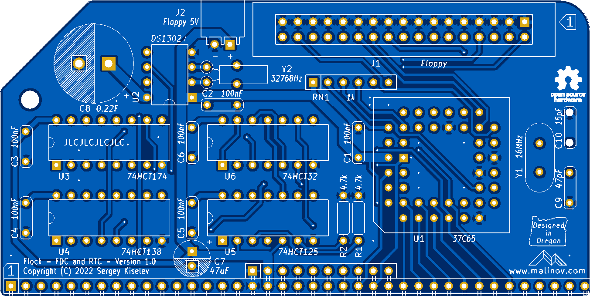
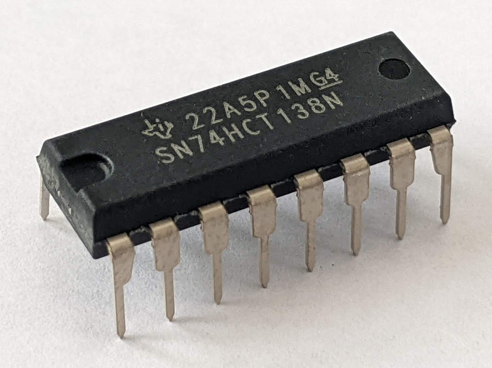
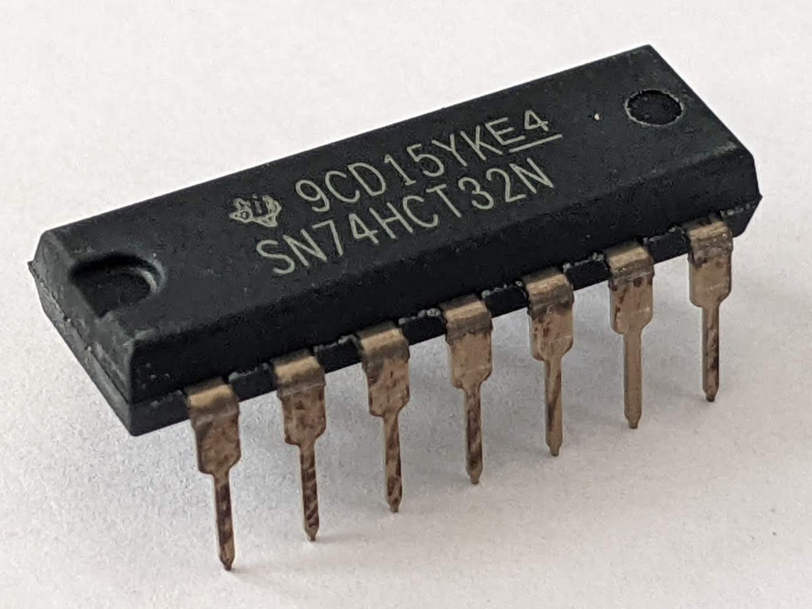
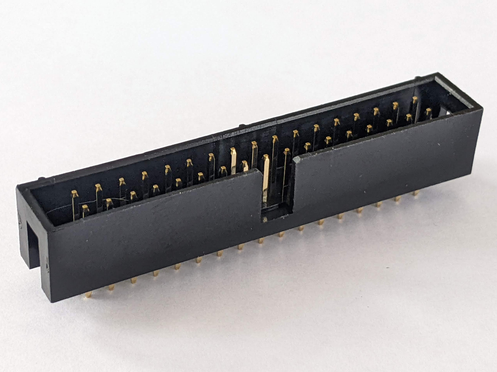
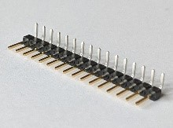
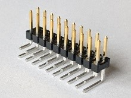
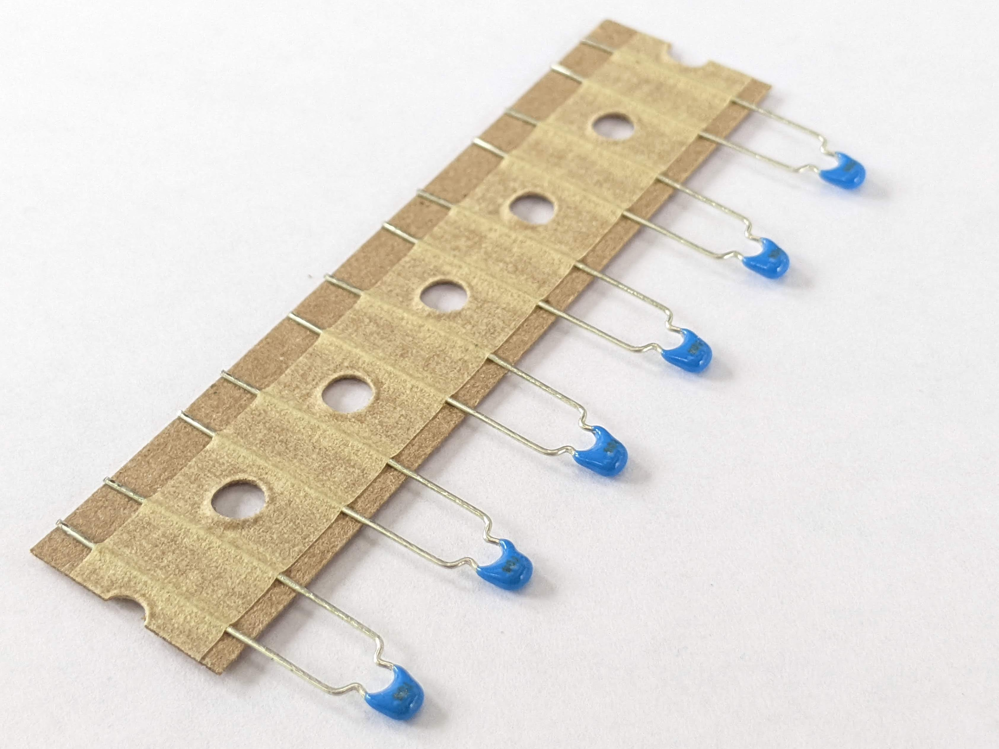
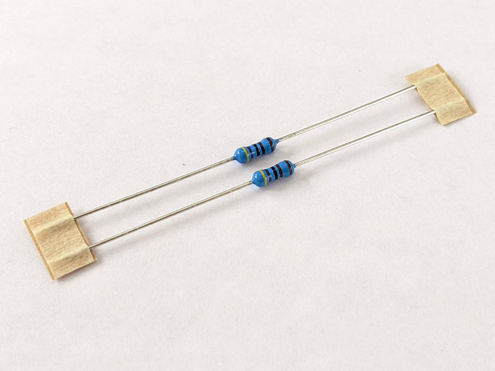
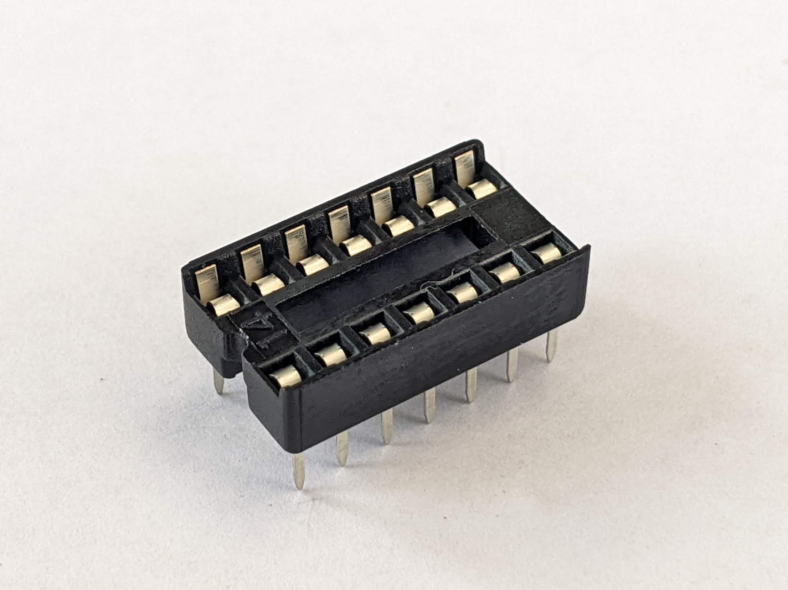
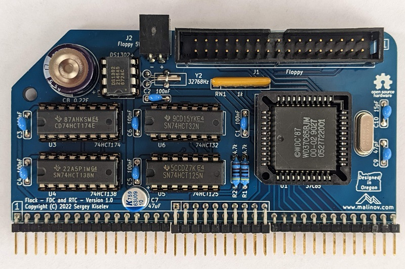

# Flock - Assembly Instructions

## Prerequisites

### Tools, Equipment, and Supplies

* Soldering iron with a fine tip. Temperature controlled soldering station is recommended
* Needle nose pliers for forming components' leads
* Small side cutters for cutting components' leads
* Multimeter with frequency measurement, an oscilloscope, or a logic analyzer can be beneficial for troubleshooting
* Desk lamp, magnifying glass
* Solder suitable for soldering electronics. For example: rosin core Sn63/Pb37, Sn60/Pb40, or a lead-free solder such as Sn96.5/Ag3.0/Cu0.5 (sometimes referred to as SAC305)
* Solder wick for removing excess of solder
* 99% Isopropyl Alcohol for removing the excess of flux after soldering
* Lint free wipes, used toothbrush, cotton swabs for cleaning the PCB before and after soldering

### Parts

The table below shows the images of the components included in the kit. The up to date list of parts provided in the [Bill of Materials](README.md#bill-of-materials) section of the [README.md](README.md) file. It also provides the recommended sources for the parts.

Image                                                                                           | Reference | Description                                            | Quantity
----------------------------------------------------------------------------------------------- | --------- | ------------------------------------------------------ | --------
                 | PCB       | Flock PCB - Version 1.0                                | 1
                    | U1        | WD37C65BJM - FDC, CMOS, 44 pin PLCC                    | 1
                 | U2        | DS1302+ - RTC, 8 pin DIP                               | 1
 | U3        | 74HCT174 - Hex D-type flip-flop with reset, 16 pin DIP | 1
 | U4      | 74HCT138 - 3-Line to 8-Line decoders/demultiplexers, 16 pin DIP        | 1
  | U5        | 74HCT125 - Quadruple bus buffer gates with 3-state outputs, 14 pin DIP | 1 
         | U6        | 74HCT32 - Quadruple 2-input positive-OR gates, 14 pin DIP              | 1
         | Y1        | Quarts crystal, 16 MHz, series                         | 1
     | Y2        | Quarts crystal, 32768 Hz, 6 pF                         | 1
 | J1      | Pin header, shrouded, 2x17 pins, 2.54 mm pitch         | 1
     | J2        | Pin header with friction lock, 2 pins, right angle     | 1 (optional)
  | J3        | Pin header, 1x16 pins, 2.54 mm pitch, right angle      | 2
  | J3, J4    | Pin header, 2x10 pins, 2.54 mm pitch, right angle      | 1
   | C1 - C6   | Capacitor, MLCC, 0.1 uF, 50V, 5 mm pitch               | 6
 | C7  | Capacitor, Organic Polymer, 10 uF, 63V, 6.3 mm diameter, 2.5 mm pitch | 1
       | C7        | Supercapacitor, 0.22 F, 5.5V, 13.5 mm diameter, 5 mm pitch            | 1
      | C9        | Capacitor, MLCC, 47 pF, 50V, 5 mm pitch                | 1
      | C10       | Capacitor, MLCC, 15 pF, 50V, 5 mm pitch                | 1
          | RN1       | Resistor Network, 1 kohm, bussed, 6 pin SIP            | 1
                   | R1, R2    | Resistor, 4.7 kohm, 0.25 W, 1% tolerance, axial        | 2
            | U1        | Integrated circuit socket, 44 pin PLCC, through hole   | 1
                | U2        | Integrated circuit socket, 8 pin DIP                   | 1 (optional)
              | U3, U4    | Integrated circuit socket, 16 pin DIP                  | 2 (optional)
              | U5, U6    | Integrated circuit socket, 14 pin DIP                  | 2 (optional)
                 |           | Floppy disk power cable                                | 1 (optional)

## Assembly Steps

### 1. Gather supplies and parts

* Check that you have all the equipment and parts listed in the [Prerequisites](#prerequisites) section above
* Organize your workspace. If available, use ESD-safe surface and ESD strap when working on this project

### 2. Solder the components

Solder the components to the PCB going from lower profile components to higher profile components, from smaller components to larger. Here is the recommended order:

* Start by soldering the R1 and R2 resistors. The resistors are not polarized and can be oriented either way. Trim the leads using cutters
* Next solder the Y1 and Y2 quartz crystals. Make a U-shaped loop using a resistor lead cut in the previous step, and secure Y2 to the PCB with that loop
* Solder RN1 resistor array. Make sure that the resistor array is oriented correctly. The first pin of the resistor array is marked with a printed dot, and the first pad on the board has a square shape
* Solder the C1 - C6, C9, and C10 capacitors. Note that these are non-polarized ceramic capacitors, so they can be oriented either way. Trim the leads using cutters
  * C1 – C6 have a “104” marking
  * C9 has “470” marking
  * C10 has “150” marking
* Solder DIP sockets for the U2 – U6 ICs. Double check the orientation of the sockets. The notch on the socket should match the notch on the PCB’s silkscreen.
Solder two opposite pins first, making sure that the socket sits flat on the PCB. Check the orientation and the alignment, fix as needed,
then solder the rest of the pins. Note that soldering the socket for U2 is optional. The real time clock would be more accurate without it,
as the socket introduces extra capacitance. You may choose to solder the DS1302 directly to the PCB at this step
*	Solder the PLCC socket for the U1 IC. Make sure that the cut side of the socket aligns with the drawing on the silkscreen
* Solder the J3 and J4 RC2014* bus connectors. Shorten one of 1x16 pin headers to 1x13 by carefully cutting or breaking away 3 pins.
Solder the 2x10 pin header first, making sure that the pins are parallel to the PCB. Next solder 1x16 and 1x13 pin headers,
making sure that they align with the first (bottom) row of the 2x10 pin header
*	Solder the J2 floppy power connector. This connector is optional. You might choose to power the floppy drive(s) directly from the power supply instead
* Solder the J1 floppy interface connector. Pay attention to the pin 1 orientation – it should be at the top right corner of the PCB,
and the polarization key notch in the connector should be located by the top edge of the PCB. Note: the kit includes a straight connector.
You might choose to replace it with a right angle pin header (not supplied) to simplify the floppy interface cable routing
and reduce intereference with the next module in the backplane
*	Solder the C7 and C8 capacitors. Pay attention to the __polarity__ – the negative side is painted white on the PCB and marked with blue (C7)
or gray with minus signs (C8) markings. Note that C7 is marked as 47uF on the PCB, and C8 is marked as 0.22F.
Install the supplied 10uF and 0.33F capacitors respectively instead

### 3. Check your soldering work

* Make sure all pins of all components are soldered properly
* If desired, clean the flux using isopropyl alcohol, cotton swabs. You might want to scrub the board lightly with a used toothbrush to remove the flux
* Check soldering work again after cleaning the board

### 4. Insert the integrated circuits to the sockets
* Prior to inserting DIP integrated circuits to the sockets board, bend their leads slightly, so they point 90 degrees downward. Put the IC on the side on a hard flat antistatic surface and gently push it down to bend the leads. Repeat on the other side of the IC
* Double check that you're placing the integrated circuit in the right socket, check the IC orientation. The index notch on the IC should match the notch on the socket and the drawing on the PCB's silkscreen
* To insert the 37C65 FDC integrated circuit in PLCC44 package, place it on the top of the socket, double check the orientation of the integrated circuit, and firmly push it down. It should click into the socket

## Module Installation Instructions

* Make sure that your RC2014*-compatible system has I/O port ranges 0x48-0x5F and 0xC0-0xC8 available for the Flock module use. If needed re-configure existing modules, and move them to other I/O addresses
* Plug the module into your system
* Connect the floppy drive(s) to the board. Standard IBM PC ribbon floppy cable with twisted wires 10-16 should be used (not supplied). The first floppy drive is the one at the end of the cable, the second is on the middle of the cable
* Connect the floppy drive(s) to power supply. A single 3.5” 1.44 MB drive can be powered directly from the Flock board, using supplied power cable. Make sure to use powerful enough power supply. The floppy drive consumes about 1A
* Rebuild RomWBW with floppy support or use the pre-built image provided in the project’s GitHub repo. Here are the brief steps to rebuild the image. See [https://github.com/wwarthen/RomWBW/blob/master/Source/ReadMe.txt](https://github.com/wwarthen/RomWBW/blob/master/Source/ReadMe.txt) for complete instructons:
    a. Download the RomWBW source or clone its Git repository: [https://github.com/wwarthen/RomWBW/releases](https://github.com/wwarthen/RomWBW/releases)
  1. Open the _Source/HBIOS/Config/RCZ80_std.asm file_ in a text editor, and set _FDENABLE_ value to _TRUE_
  2. From the _Source_ folder, run the **BuildShared** command. This will build software that is shared by all RomWBW images
  3. From the _Source_ folder, run the **BuildRom** command. Select “RCZ80” platform and “std” configuration
  4. The resulting ROM image will be located in the Binary folder and will be named _RCZ80_std.rom_. Program the image to your systems’ flash ROM using either an EPROM programmer or FLASH4 command
* Power on your system. Verify that RomWBW shows DSRTC: device, reads the time from the RTC, shows FD: device, and displays floppy disk drives as shown in the screenshot below:

## Module Usage Instructions – Floppy Disk Controller
The FDU utility included in RomWBW and can be used to test the floppy disk controller and to format floppy disks
*	Boot your system to CP/M or ZSDOS and run the **FDU** command. Type **H** to select “(H) RC2014 WDC (SMB)”
*	Use the **S** command to set the floppy disk configuration. Select the correct media type (e.g., enter “01” for 1.44 MB disks), leave the default settings for mode and trace
*	Use the **F** command to format the floppy disk. Note that all information on the disk will be destroyed
*	Use the **R** and **W** commands to test reading from and writing to the floppy disk
Once formatted, the floppy disk can be accessed from CP/M and ZSDOS. RomWBW normally assigns letters _C:_ and _D:_ to the first and the second floppy drives respectively

## Module Usage Instructions – FAT12 Floppy formatting
The FAT utility included with RomWBW will format floppies to FAT12, rendering them writable on modern computers.
*	Boot your system to an OS which supports the FAT utility (I.E. ZP/M). 
*	Observe the disk unit number when booting your system for FD0 (I.E. Disk 2)
*	Run **FAT FORMAT 2:** and be absolutely sure your disk unit number is correct.  
*	Wait for the format to complete.
Once formatted, the disk can be used with a modern computer, such as with a USB to 1.44 Floppy drive. The floppy disk can be accessed only using the FAT utility on RomWBW; Formatting a disk this way is primarily to use it for a bridge to a modern machine. The FAT utility is used to copy files between your CP/M etc. system storage, and the FAT formatted floppy disk.

## Module Usage Instructions – Real Time Clock
The RTC utility included in RomWBW is used to set and test the real time clock
*	Boot your system to CP/M or ZSDOS and run the **RTC** command
*	Use the **I** command to enter the current date and time. Use two digit values for each entry
*	Use the **S** command to set the RTC to the time entered in the previous step with I command
*	Use the **T** command to print the current time. Check that the time is set correctly and RTC properly updates the time
*	Use the **C** command to enable trickle charge, so that DS1302 will be charing the on-board supercapacitor

__Congratulations! Enjoy your Flock Module!__

